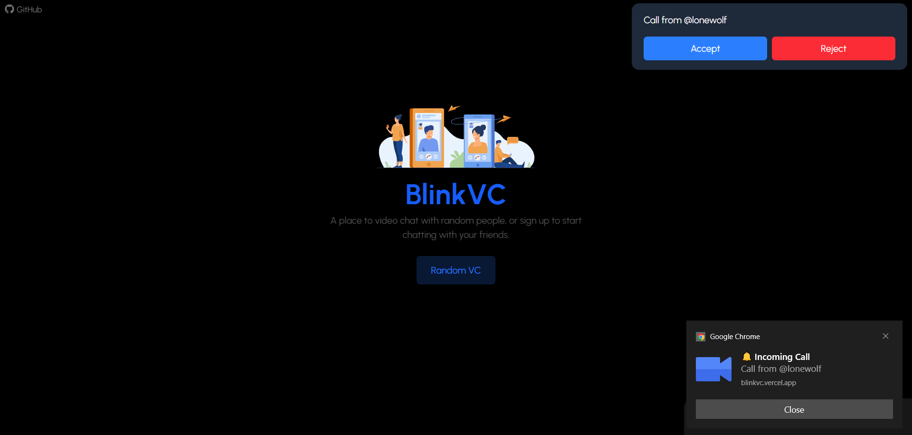
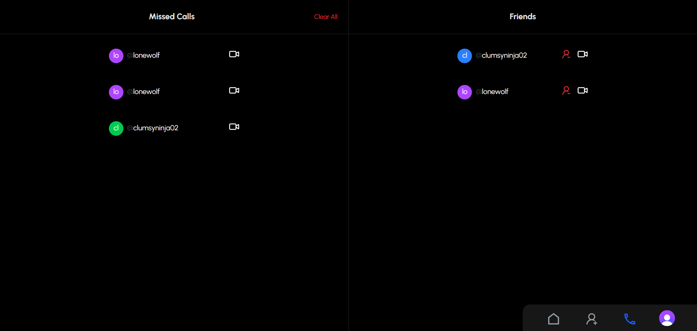
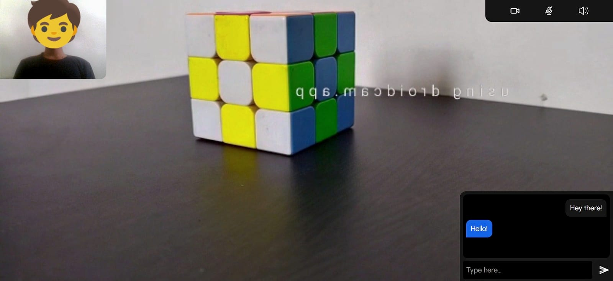

# BlinkVC

**BlinkVC** is a real-time video chat platform where you can instantly connect with random people or sign up to chat with your friends. It combines video, chat, and secure identity management.

## Tech Stack

| Layer     | Technology |
|-----------|------------|
| Frontend  |  |
| Backend   |  |
| Auth      | |
| Realtime  |  |
| Styling   | |

## Features

- **Random Video Chat**: Connect anonymously with random users.
- **Calls with Friends**: Add users by their userID to initiate direct calls.
- **In-Call Messaging**: Chat while on a video call without interruptions.
- **Call Controls**:
  - Toggle **video** & **mic**
  - Mute/unmute **audio**
- **Account Management**:
  - Sign up/sign in with Clerk
  - Delete your account anytime
- **Real-Time** Communication using WebRTC & WebSockets

## User Guide

1. Visit [blinkvc.vercel.app](https://blinkvc.vercel.app)
2. Try **Random Chat** without an account
3. Or **Sign up** to:
   - Add friends by user ID
   - Access private calls
   - Manage your profile

4. During a call:
- Use the chatbox to message
- Click icons to toggle video/audio

## User Interface

## Author
